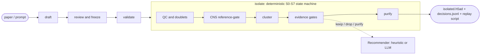

# rarecell

**rarecell** is an agentic toolkit for **rigorous, reproducible isolation of rare
and hard-to-resolve cell populations and states** from single-cell RNA-seq. Given
a marker-defined target drafted from a paper, it narrows the search space, extracts
the population, and purifies it — *even when the target sits at ~0.1% or is a
continuous state that won't separate by clustering* — with a full provenance trail.

> *Describe the population in English. Get an audited, replayable isolation.*

**Status: pre-release (v0.x).** APIs, file layouts, and CLI surfaces may change
before v1.0.

## What it does

Give rarecell an `.h5ad` dataset and a target population. It runs a five-step,
human-in-the-loop workflow:

**`draft → review → validate → isolate → replay`**

1. **draft** — an LLM agent reads your natural-language target, retrieves candidate
   markers from the literature (optionally anchored to a specific paper), and emits
   a reviewable `TargetCellProfile` (YAML).
2. **review** — you edit and **freeze** the profile. It is content-hashed; the
   pipeline refuses to run on an unreviewed profile.
3. **validate** — a pre-flight check confirms the markers exist in your data and
   score sensibly *before* you spend compute.
4. **isolate** — a deterministic state machine narrows, clusters, scores, and
   purifies, emitting the isolated cells plus a full decision log.
5. **replay** — every run ships a script that reproduces it bit-for-bit.

## See it work

[](https://colab.research.google.com/github/PatrickJReed/rarecell/blob/main/examples/colab_demo.ipynb)

The **paper-to-cells demo** answers a concrete question: *can I isolate a
disease-associated population from my data using markers from a specific paper?* It
runs end-to-end (~10 min) on a real schizophrenia DLPFC sample from the public
[brainSCOPE](https://brainscope.gersteinlab.org/) cohort, with Claude drafting an
astrocyte marker panel directly from Ling et al., *Nature* 2024
([PMID:38448582](https://pubmed.ncbi.nlm.nih.gov/38448582/)). Requires an Anthropic
API key (~$0.05 for the single drafting call). Source: `examples/colab_demo.ipynb`.

**What is verified today:** the full pipeline runs end-to-end on synthetic data and
**replays deterministically** (186 passing tests). A characterized precision/recall
benchmark of the astrocyte isolation against brainSCOPE's own annotations is the
next milestone — *no accuracy numbers are claimed here that aren't measured yet.*

## How it works



Four layers:

- **A deterministic state machine (S0–S7).** A frozen `TargetCellProfile` threads
  through ingest → QC + doublet removal → optional CNS reference-gate → clustering →
  three evidence gates → surgical purification → abundance check → report. Seeds are
  pinned, so runs replay exactly.
- **Two agentic surfaces.** *Drafting* turns a paper + prompt into a reviewable
  marker profile — the agent's strongest contribution. *Recommending* is a pluggable
  `Recommender` that issues keep/drop/purify per cluster: a transparent heuristic
  (`BasicRecommender`) by default, or an LLM-backed `ClaudeRecommender`.
- **A provenance layer.** Frozen content-hashed profiles, a `decisions.jsonl` log, a
  bibliography, and a replay script — every isolation is auditable and reproducible.
- **A CNS reference-gate (depth module).** A pipeline built from the public
  BICCN / Siletti human-brain atlas hard-subsets to the relevant supercluster
  *before* clustering — which is how a 0.1% target becomes findable.

## What's genuinely novel

- **Natural language + a paper → a reviewable marker profile**, grounded in
  literature retrieval rather than hand-curation.
- **Provenance and replay-determinism as first-class outputs**, not an afterthought.
- **Reference-gated narrowing** that makes genuinely low-abundance targets
  recoverable.

## What this is — and what it deliberately is not

rarecell does **rigorous targeted isolation**: given a marker definition, it
extracts a *specified* population or state cleanly, even when it is rare or does not
form its own cluster. The hard part it is built for is not *knowing* the markers —
it is pulling the population out at low abundance and high purity:

- **Low abundance breaks clustering.** A target at ~0.1% (e.g. T cells in brain
  tissue) is absorbed into a transcriptionally adjacent neighbor by global Leiden;
  the reference-gate reduces the haystack first.
- **States are not types.** A SNAP-astrocyte program or a microglial activation
  state is a continuous axis *within* a cell type — it may not separate at any
  resolution, so marker scoring + negative-panel gating fits better than recursive
  clustering.

It is **not** a de-novo *discovery* tool: it isolates a target you define, it does
not surface unknown populations from scratch. For discovery, pair it with a
dedicated method (GiniClust / RaceID / Milo).

## Limitations

- **Requires a target definition.** rarecell isolates a *specified* population; it
  does not discover unknown ones de novo (see above).
- **Isolation quality is bounded by signal-to-noise.** At very low abundance or for
  diffuse continuous states, recovery and purity depend on marker specificity and
  contamination, and should be **validated per target** — the tool makes the process
  rigorous and auditable, not infallible.
- **The LLM recommender is marginal over the heuristic on clean cases.** Its value
  is in drafting, adjudicating conflicting evidence, and explaining decisions; every
  decision is logged and human-frozen. A head-to-head comparison is planned.
- **Validation scope today is one cohort + a PBMC integration test**, not a broad
  multi-tissue benchmark.
- **The CNS reference-gate requires building/publishing the reference bundle** (a
  one-time offline step; see `scripts/build_cns_reference/`).
- **rarecell orchestrates mature tools** (scanpy, CellTypist, Scrublet, Harmony);
  the contribution is the agent layer + provenance + opinionated pipeline, not new
  core algorithms.

## Design & process

This project is built spec-first. The design documents and implementation plans
behind the CNS subsystem (reference build, progressive taxonomy gate, target
resolution) live under
[`docs/superpowers/specs/`](docs/superpowers/specs/) and
[`docs/superpowers/plans/`](docs/superpowers/plans/) — spec → plan → execute, with
each artifact committed alongside the code it produced.

## Install & use

This repository is a [uv workspace](https://docs.astral.sh/uv/concepts/workspaces/)
with three packages:

- `packages/rarecell/` — the core library (preprocessing, integration, clustering,
  marker-panel scoring, evidence aggregation, the isolation state machine).
- `packages/rarecell-mcp-knowledge/` — a FastMCP server for literature + marker
  retrieval (CellMarker, PanglaoDB, MSigDB, Enrichr, Europe PMC).
- `packages/rarecell-mcp/` — a FastMCP workflow server exposing
  `draft | validate | isolate | inspect` to any MCP client.

**CLI** (`pip install rarecell`):

```bash
rarecell isolate --input adata.h5ad --profile profile.yaml --out-dir runs/run1
rarecell draft   --prompt "T cells in CNS tissue" --out draft.yaml   # needs [agent] + ANTHROPIC_API_KEY
rarecell review  --report runs/run1
```

**Agent extra** — `ClaudeRecommender` and natural-language drafting are gated behind
an optional extra (`pip install 'rarecell[agent]'`). Without it, `rarecell.core`
works unchanged with the heuristic `BasicRecommender`.

**MCP** — drive the workflow from Claude Desktop / Claude Code / Cursor:

```json
{"mcpServers": {"rarecell": {"command": "rarecell-mcp", "args": ["serve"]}}}
```

**Develop locally:**

```bash
uv sync --all-packages --all-extras --dev
uv run pytest
```

See `CONTRIBUTING.md` for the full development workflow.
